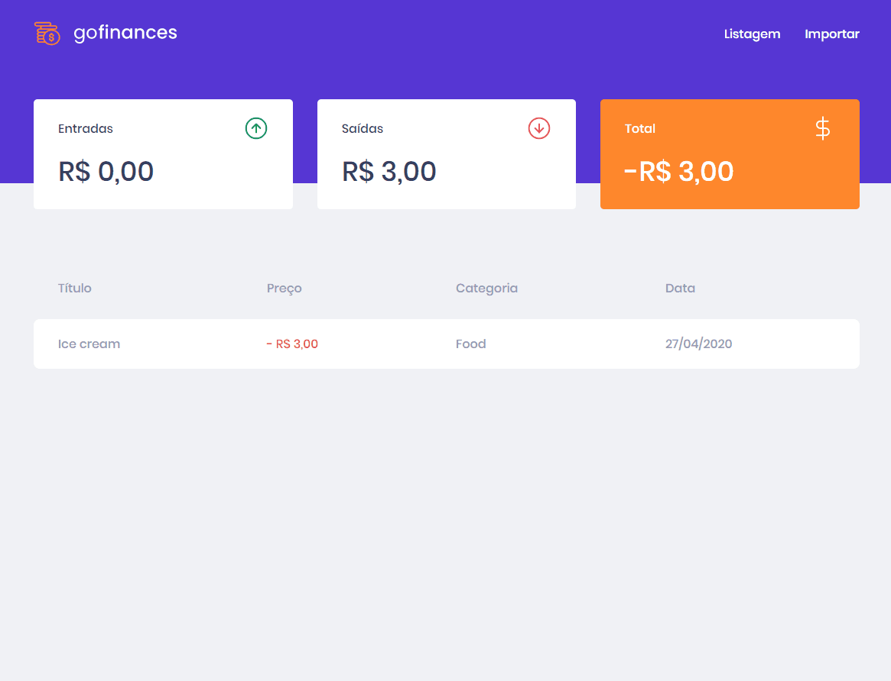

<h1 align="center">
  
</h1>

<h3 align="center" >
  An application to control your finances
</h3>

<p align="center">
  
  
  
  <a href="https://github.com/jarielfloriano/go-finances/commits/master">
    
  </a>
   <a href="https://github.com/jarielfloriano/go-finances/issues">
    
  </a>
  
</p>
<p align="center">

  <a href="https://github.com/jarielfloriano" target="_blank">
    
  </a>
  <a href="https://github.com/jarielfloriano" target="_blank" >
    
  </a>
  <a href="https://www.linkedin.com/in/jarielfloriano/" target="_blank" >
    
  </a>
  <a href="mailto:jarielfloriano@gmail.com" target="_blank" >
    
  </a>
  <a href="https://api.whatsapp.com/send?phone=5519991830454"
        target="_blank" >
    
  </a>

</p>

<p align="center">
  <a href="#computer-languages">Languages</a>&nbsp;&nbsp;&nbsp;|&nbsp;&nbsp;&nbsp;
  <a href="#books-technologies">Technologies</a>&nbsp;&nbsp;&nbsp;|&nbsp;&nbsp;&nbsp;
  <a href="#install">Install</a>&nbsp;&nbsp;&nbsp;|&nbsp;&nbsp;&nbsp;
  <a href="#books-usage">Usage</a>&nbsp;&nbsp;&nbsp;|&nbsp;&nbsp;&nbsp;
  <a href="#memo-license">License</a>
</p>

## :computer: Languages

- **#TypeScript**

## :books: Technologies

- **#React**
- **#ESLint**
- **#Prettier**
- **#Styled-Components**
- **#Axios**

## Install

```sh
yarn install
```

## Usage

```sh
yarn start
```

## Author

👤 **Jariel Floriano**

* Github: [@jarielfloriano](https://github.com/jarielfloriano)
* Linkedin: [@jariel-floriano](https://www.linkedin.com/in/jariel-floriano)

## 🤝 Contributing

Contributions, issues and feature requests are welcome!<br />Feel free to check [issues page](https://github.com/jarielfloriano/go-finances/issues). You can also take a look at the [contributing guide](https://github.com/jarielfloriano/go-finances/blob/master/CONTRIBUTING.md).

## Show your support

Give a ⭐️ if this project helped you!

## 📝 License

Copyright © 2020 [Jariel Floriano](https://github.com/jarielfloriano).<br />
This project is [MIT](https://github.com/jarielfloriano/go-finances/blob/master/LICENSE) licensed.

---

Made by :blue_heart: by [Jariel Floriano](https://github.com/jarielfloriano)
